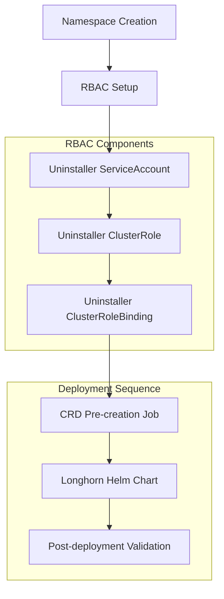

# Design Document

## Overview

The Longhorn uninstaller failure is a common issue that occurs when the Longhorn uninstaller job lacks proper RBAC permissions, encounters CRD conflicts, or fails to handle existing resources correctly. This design addresses the root causes by implementing proper RBAC configuration, CRD management, and deployment sequencing for the Longhorn component.

Based on analysis of the existing codebase and common Longhorn deployment patterns, the primary issues are:

1. **Missing RBAC permissions** for the uninstaller job to access required Kubernetes resources
2. **CRD timing conflicts** when the deleting-confirmation-flag setting is created after the Helm chart
3. **Insufficient error handling** for cleanup operations and dependency validation
4. **Lack of proper sequencing** between CRD creation and Helm chart deployment

## Architecture

The solution follows the established patterns in the rzp-infra project, particularly the webhook readiness job pattern used in cert-manager and MetalLB components. The architecture consists of:



### Key Design Principles

1. **Explicit RBAC Management**: Create dedicated ServiceAccount and RBAC permissions for uninstaller operations
2. **CRD Pre-creation**: Ensure required CRDs and settings exist before Helm chart deployment
3. **Dependency Validation**: Verify prerequisites (open-iscsi, node readiness) before deployment
4. **Error Recovery**: Implement proper cleanup and retry mechanisms

## Components and Interfaces

### 1. Enhanced Longhorn Component Interface

```typescript
export interface ILonghornArgs {
  readonly namespace: string;
  readonly chartVersion: string;
  readonly environment: Environment;
  readonly domain: string;
  readonly defaultStorageClass: boolean;
  readonly replicaCount: number;
  readonly adminPassword: pulumi.Input<string>;
  readonly backupTarget?: string;
  readonly s3BackupConfig?: {
    bucket: string;
    region: string;
    accessKeyId: pulumi.Input<string>;
    secretAccessKey: pulumi.Input<string>;
    endpoint?: string;
  };
  // New options for uninstaller management
  readonly enableUninstallerRbac?: boolean;
  readonly uninstallerTimeoutSeconds?: number;
  readonly validatePrerequisites?: boolean;
}
```

### 2. Uninstaller RBAC Components

- **ServiceAccount**: Dedicated service account for uninstaller operations
- **ClusterRole**: Comprehensive permissions for CRD and resource management
- **ClusterRoleBinding**: Binding the service account to the cluster role

### 3. CRD Management Components

- **CRD Pre-creation Job**: Ensures required CRDs exist before Helm deployment
- **Settings Validation Job**: Verifies deleting-confirmation-flag is properly set
- **Dependency Check Job**: Validates node prerequisites (open-iscsi)

### 4. Enhanced Error Handling

- **Deployment Status Monitoring**: Track deployment progress and failures
- **Cleanup Utilities**: Proper resource cleanup on failure
- **Retry Mechanisms**: Automatic retry for transient failures

## Data Models

### 1. Uninstaller RBAC Configuration

```typescript
interface IUninstallerRbacConfig {
  readonly serviceAccountName: string;
  readonly clusterRoleName: string;
  readonly clusterRoleBindingName: string;
  readonly namespace: string;
}
```

### 2. CRD Management Configuration

```typescript
interface ICrdManagementConfig {
  readonly requiredCrds: string[];
  readonly requiredSettings: Array<{
    name: string;
    value: string;
    apiVersion: string;
    kind: string;
  }>;
  readonly timeoutSeconds: number;
}
```

### 3. Deployment Status Tracking

```typescript
interface IDeploymentStatus {
  readonly phase: 'initializing' | 'rbac-setup' | 'crd-setup' | 'helm-deployment' | 'validation' | 'complete' | 'failed';
  readonly message: string;
  readonly timestamp: Date;
  readonly retryCount: number;
}
```

## Error Handling

### 1. RBAC Permission Errors

- **Detection**: Monitor for "forbidden" errors in uninstaller job logs
- **Resolution**: Automatically create or update RBAC permissions
- **Prevention**: Pre-validate RBAC configuration before deployment

### 2. CRD Conflicts

- **Detection**: Check for existing CRDs with different versions
- **Resolution**: Update or recreate CRDs as needed
- **Prevention**: Use CRD pre-creation jobs with proper sequencing

### 3. Node Prerequisite Failures

- **Detection**: Validate open-iscsi installation on all nodes
- **Resolution**: Provide clear error messages with remediation steps
- **Prevention**: Add prerequisite validation to deployment pipeline

### 4. Timeout and Retry Logic

- **Configurable Timeouts**: Allow customization of timeout values
- **Exponential Backoff**: Implement retry logic with exponential backoff
- **Circuit Breaker**: Prevent infinite retry loops

## Testing Strategy

### 1. Unit Tests

- **RBAC Configuration Tests**: Verify correct RBAC resource creation
- **CRD Management Tests**: Test CRD pre-creation and validation logic
- **Error Handling Tests**: Validate error detection and recovery mechanisms
- **Configuration Validation Tests**: Ensure proper input validation

### 2. Integration Tests

- **End-to-End Deployment Tests**: Full Longhorn deployment with uninstaller
- **Failure Scenario Tests**: Test behavior under various failure conditions
- **Upgrade/Downgrade Tests**: Validate version transition scenarios
- **Multi-Node Tests**: Test deployment across multiple cluster nodes

### 3. Validation Tests

- **RBAC Permission Tests**: Verify uninstaller has required permissions
- **CRD Availability Tests**: Confirm CRDs are available before Helm deployment
- **Prerequisite Validation Tests**: Check node-level requirements
- **Cleanup Verification Tests**: Ensure proper resource cleanup

### 4. Performance Tests

- **Deployment Time Tests**: Measure deployment duration improvements
- **Resource Usage Tests**: Monitor resource consumption during deployment
- **Concurrent Deployment Tests**: Test multiple simultaneous deployments
- **Large Cluster Tests**: Validate performance on larger node counts

## Implementation Phases

### Phase 1: RBAC Enhancement
- Create uninstaller ServiceAccount, ClusterRole, and ClusterRoleBinding
- Update Longhorn component to use dedicated RBAC resources
- Add RBAC validation and error handling

### Phase 2: CRD Management
- Implement CRD pre-creation job pattern
- Add settings validation for deleting-confirmation-flag
- Ensure proper sequencing between CRD setup and Helm deployment

### Phase 3: Prerequisite Validation
- Add node prerequisite validation (open-iscsi)
- Implement dependency checking before deployment
- Provide clear error messages for missing prerequisites

### Phase 4: Error Handling and Monitoring
- Enhance error detection and reporting
- Add retry mechanisms with exponential backoff
- Implement deployment status tracking and monitoring

### Phase 5: Testing and Validation
- Comprehensive test suite for all scenarios
- Integration tests with existing infrastructure
- Performance optimization and validation
