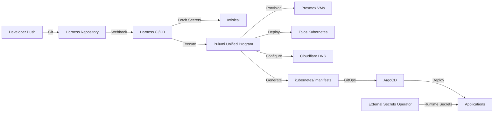

# RZP Infrastructure

> Unified infrastructure-as-code platform orchestrating bare metal to application layer through a single Pulumi program

## Overview

This monorepo implements a comprehensive homelab infrastructure that spans from Proxmox VM provisioning to Kubernetes
application deployment, all managed through a unified Pulumi codebase. The architecture demonstrates enterprise-grade
practices—strict GitOps workflows, centralized secret management, and comprehensive observability—while maintaining
single-operator sustainability at 70+ service scale.

### Key Architectural Decisions

- **Unified Infrastructure Control**: Single Pulumi program manages Proxmox VMs, Talos Kubernetes, and all applications
- **Strict GitOps Workflow**: Harness CI/CD enforces all changes through Git with approval gates
- **Centralized Secret Management**: Infisical serves as single source of truth, with ESO for runtime injection
- **Purpose-Driven Taxonomy**: Services organized by operational intent within a hierarchical configuration
- **Comprehensive Observability**: Vector → OpenObserve pipeline with Netdata real-time metrics

## Code Quality Standards

This project adheres to SOLID principles, recognizing that infrastructure-as-code demands the same engineering rigor as
application development. When contributing to the Pulumi codebase, follow these guidelines:

### SOLID Principles for Infrastructure Code

**Single Responsibility Principle (SRP)**

- Each Pulumi component should manage one infrastructure concern (e.g., `PostgreSQLCluster`, not
  `DatabaseAndBackupAndMonitoring`)
- Service modules under `infrastructure/src/apps/` should focus on a single domain
- Separate provisioning logic from configuration management

**Open/Closed Principle (OCP)**

- Use base component classes that can be extended without modification
- Implement configuration-driven behavior through `Pulumi.*.yaml` files
- Design service templates that support variation through composition

**Liskov Substitution Principle (LSP)**

- Ensure custom Pulumi components can substitute base components seamlessly
- Maintain consistent interfaces when creating specialized service types
- Never break expected behaviors when extending infrastructure patterns

**Interface Segregation Principle (ISP)**

- Create focused interfaces for different infrastructure concerns (networking, storage, compute)
- Avoid monolithic service definitions that force dependencies on unused features
- Design role-based components (e.g., `StatefulService`, `WebService`, `CronJob`)

**Dependency Inversion Principle (DIP)**

- Depend on abstractions like `BaseService` rather than concrete implementations
- Inject configuration and secrets through abstractions, not direct access
- Use Pulumi's input/output types to maintain loose coupling

See [SOLID Guidelines](docs/architecture/patterns/SOLID-guidelines.md) for comprehensive principles and examples.

### Testing Philosophy

- **Type Validation**: Enforce service contracts at compile time
- **Resource Constraints**: Prevent cluster/VM resource exhaustion
- **Network Topology**: Validate subnet allocations and port conflicts
- **Security Policies**: Ensure zero-trust network boundaries

## Infrastructure Hierarchy

The unified Pulumi program manages infrastructure in layers:

- **Layer 0**: Proxmox VMs (control plane, worker nodes)
- **Layer 1**: Talos Kubernetes cluster bootstrapping
- **Layer 2**: Core platform services (storage, networking, observability)
- **Layer 3**: Applications (70+ services across multiple domains)

## Repository Structure

- Purpose-driven architecture: categorize by the job each service performs, not merely its technical capabilities.
- Follow the 5-Level Rule: directories should not exceed 5 levels deep to avoid complexity and index degradation.

```bash
/Users/stephen/Projects/rzp-infra/
├── infrastructure/
│   ├── src/
│   │   ├── generators/
│   └── tests/
├── bootstrap/
│   └── argocd/
│       ├── gotk-sync.yaml
│       ├── namespace.yaml
│       └── README.md
├── kubernetes/
│   ├── core/
│   │   ├── namespaces/
│   │   ├── metallb/
│   │   ├── cert-manager/
│   │   ├── external-secrets/
│   │   ├── longhorn/
│   │   └── traefik/
│   ├── platform/
│   │   ├── observability/
│   │   │   ├── vector/
│   │   │   ├── openobserve/
│   │   │   ├── netdata/
│   │   │   └── posthog/
│   │   ├── backup/
│   │   │   ├── velero/
│   │   │   └── minio/
│   │   ├── databases/
│   │   │   ├── postgresql/
│   │   │   └── redis/
│   │   └── security/
│   │       └── zitadel/
│   ├── apps/
│   │   ├── media/
│   │   │   ├── acquisition/
│   │   │   │   ├── prowlarr
│   │   │   │   ├── sonarr
│   │   │   │   ├── radarr
│   │   │   │   ├── nzbhydra2
│   │   │   │   ├── sabnzbd
│   │   │   │   ├── qbittorrent
│   │   │   ├── streaming/
│   │   │   │   ├── plex
│   │   │   │   ├── kavita
│   │   │   └── management/
│   │   │   │   ├── tautulli
│   │   │   │   ├── organizr
│   │   ├── home-automation/
│   │   │   ├── home-assistant
│   │   │   ├── mosquitto
│   │   │   └── node-red
│   │   ├── dev-tools/
│   │   │   ├── harness
│   │   │   ├── backstage
│   │   │   ├── harbor
│   │   │   └── portainer
│   │   ├── ai/
│   │   │   ├── ollama
│   │   │   ├── langfuse
│   │   │   └── jupyter
│   │   └── more-categories/
│   └── shared-config/
│       ├── ingress-routes/
│       ├── network-policies/
│       ├── backup-policies/
│       └── secrets/
├── docs/
│   ├── architecture/
│   │   ├── decisions/
│   │   ├── patterns/
│   │   └── diagrams/
│   ├── operations/
│   │   ├── runbooks/
│   │   ├── guides/
│   │   └── maintenance/
│   └── reference/
│       ├── service-catalog/
│       ├── network-topology/
│       ├── port-registry.md
│       └── backup-inventory/
├── .gitignore
├── editorconfig
├── pre-commit-config.yaml
├── README.md
```

The structure enforces a 5-level directory depth limit based on empirical performance testing (see
[ADR-002](docs/architecture/decisions/ADR-002-five-level-directory-limit.md)).

## Service Domains

Planned orchestration of 70+ services across purpose-driven domains. Examples include:

### Platform Services

- **Virtualization**: Proxmox cluster with automated VM provisioning
- **Kubernetes**: Talos Linux for immutable, secure control plane
- **Databases**: PostgreSQL (HA), Redis Sentinel
- **Observability**: Vector, OpenObserve, Netdata
- **Security**: Zitadel (identity), cert-manager, Infisical (secrets)
- **Storage**: Longhorn (distributed), MinIO (S3-compatible)

### Development Platform

- Harness (Git + CI/CD), Harbor (OCI Registry), Backstage, Portainer

### Media Ecosystem

- **Acquisition**: Sonarr, Radarr, Prowlarr, SABnzbd, qBittorrent, NZBHydra2
- **Streaming**: Plex, Kavita
- **Management**: Overseerr, Tautulli

### AI/ML Stack

- Ollama (LLM inference), Langfuse (observability), Jupyter

### Home Automation

- Home Assistant, Node-RED, Mosquitto, Zigbee2MQTT, ESPHome

## Deployment Pipeline



## Technology Stack

- **Hypervisor**: Proxmox VE for VM management
- **Kubernetes**: Talos Linux for immutable control plane
- **IaC**: Pulumi (Python) managing entire stack
- **GitOps**: Harness Git + CI/CD + ArgoCD
- **Secrets**: Infisical + External Secrets Operator
- **Observability**: Vector + OpenObserve + Netdata
- **Storage**: Longhorn + NFS + MinIO

## Secret Management Strategy

Infisical provides centralized secret management with multiple injection points:

1. **CI/CD Secrets**: Harness fetches infrastructure tokens from Infisical
2. **Pulumi Runtime**: Secrets injected as environment variables
3. **Kubernetes Runtime**: External Secrets Operator creates K8s secrets
4. **Zero Application Knowledge**: Apps consume standard K8s secrets

This multi-layer approach ensures secrets are never committed to Git while maintaining operational simplicity.

## Observability Strategy

Three-layer observability providing complete operational visibility:

1. **Infrastructure Metrics**: Netdata (1-second granularity)
2. **Application Logs/Traces**: OpenObserve (unified storage)
3. **Data Flow**: Vector (routing and transformation)
4. **User Analytics**: PostHog (behavior metrics)

## Disaster Recovery

Complete infrastructure rebuild achievable through GitOps:

```bash
# Manual bootstrap only for ArgoCD
kubectl apply -f bootstrap/argocd/

# Everything else rebuilds from Git
# Harness pipeline re-provisions from Proxmox up
```
