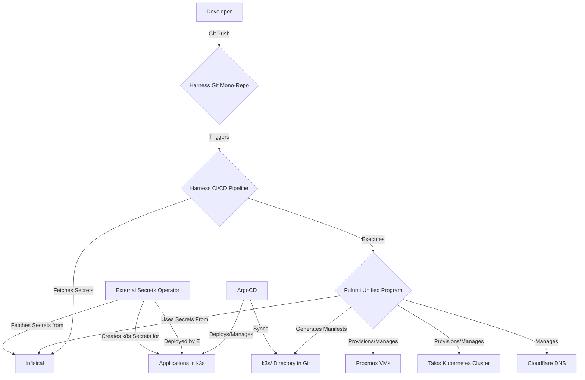

# Architectural Plan

This document provides the definitive architectural plan for the homelab infrastructure. It is a direct and actionable
translation of the principles and structures defined in the
[`gitops-mono-repo-strategy.md`](./gitops-mono-repo-strategy.md), tailored for implementation with Pulumi and Harness.

## 1. High-Level Overview

The architecture is a strict GitOps workflow. The mono-repo on Harness is the single source of truth. All changes to the
desired state are made via Git commits, which trigger a Harness CI/CD pipeline. This pipeline executes a unified Pulumi
program to provision and manage all resources—from Proxmox VMs and Talos Kubernetes clusters to the applications running
within them. Infisical serves as the central secret store, with secrets dynamically injected at runtime by the CI/CD
pipeline and the in-cluster External Secrets Operator.



## 2. Git Repository Structure

- Purpose-driven architecture: categorize by the job each service performs, not merely its technical capabilities.
- Follow the 5-Level Rule: directories should not exceed 5 levels deep to avoid complexity and index degradation.

```bash
/Users/stephen/Projects/rzp-infra/
├── infrastructure/
│   ├── src/
│   │   ├── generators/
│   └── tests/
├── bootstrap/
│   └── argocd/
│       ├── gotk-sync.yaml
│       ├── namespace.yaml
│       └── README.md
├── kubernetes/
│   ├── core/
│   │   ├── namespaces/
│   │   ├── metallb/
│   │   ├── cert-manager/
│   │   ├── external-secrets/
│   │   ├── longhorn/
│   │   └── traefik/
│   ├── platform/
│   │   ├── observability/
│   │   │   ├── vector/
│   │   │   ├── openobserve/
│   │   │   ├── netdata/
│   │   │   └── posthog/
│   │   ├── backup/
│   │   │   ├── velero/
│   │   │   └── minio/
│   │   ├── databases/
│   │   │   ├── postgresql/
│   │   │   └── redis/
│   │   └── security/
│   │       └── zitadel/
│   ├── apps/
│   │   ├── media/
│   │   │   ├── acquisition/
│   │   │   │   ├── prowlarr
│   │   │   │   ├── sonarr
│   │   │   │   ├── radarr
│   │   │   │   ├── nzbhydra2
│   │   │   │   ├── sabnzbd
│   │   │   │   ├── qbittorrent
│   │   │   ├── streaming/
│   │   │   │   ├── plex
│   │   │   │   ├── kavita
│   │   │   └── management/
│   │   │   │   ├── tautulli
│   │   │   │   ├── organizr
│   │   ├── home-automation/
│   │   │   ├── home-assistant
│   │   │   ├── mosquitto
│   │   │   └── node-red
│   │   ├── dev-tools/
│   │   │   ├── harness
│   │   │   ├── backstage
│   │   │   ├── harbor
│   │   │   └── portainer
│   │   ├── ai/
│   │   │   ├── ollama
│   │   │   ├── langfuse
│   │   │   └── jupyter
│   │   └── more-categories/
│   └── shared-config/
│       ├── ingress-routes/
│       ├── network-policies/
│       ├── backup-policies/
│       └── secrets/
├── docs/
│   ├── architecture/
│   │   ├── decisions/
│   │   ├── patterns/
│   │   └── diagrams/
│   ├── operations/
│   │   ├── runbooks/
│   │   ├── guides/
│   │   └── maintenance/
│   └── reference/
│       ├── service-catalog/
│       ├── network-topology/
│       ├── port-registry.md
│       └── backup-inventory/
├── .gitignore
├── editorconfig
├── pre-commit-config.yaml
├── README.md
```

## 3. Project and Stack Design

### Single Project, Modular Code

To adhere strictly to the monorepo principle, we use a **single project**. Modularity is achieved through Python's
package system, not multiple Pulumi projects.

- **`/infrastructure/` Explained**: This directory contains all the logic.

  - **`core/`**: Defines foundational resources like Proxmox VMs and Cloudflare DNS.
  - **`platform/`**: Defines the Talos cluster and the core/platform services that run on it (e.g., observability,
    storage).
  - **`apps/`**: This is the key to managing 100+ services cleanly. Each module is responsible for defining the resources for a specific category of
    applications. This avoids a monolithic, "repo per service" anti-pattern.

### Hierarchical Configuration

A single `Pulumi.production.yaml` file manages configuration for all services using a hierarchical key structure.

```yaml
# infrastructure/Pulumi.production.yaml
config:
  proxmox:
    # ... proxmox config ...
  apps:
    media:
      sonarr:
        imageTag: "latest"
      radarr:
        imageTag: "latest"
    ai:
      ollama:
        imageTag: "0.1.40"
```
