# rzp-infra Deployment Flow & Health Check Architecture

## Overview

This document visualizes the complete deployment flow of the rzp-infra staging environment, showing component dependencies, health checks, and the order of operations.

## Deployment Flow Diagram

```mermaid
graph TD
    %% Infrastructure Layer
    subgraph "Infrastructure Layer"
        K3sCluster[K3s Cluster<br/>VM Creation]

        K3sCluster --> Masters[Master VMs<br/>Created]
        K3sCluster --> Workers[Worker VMs<br/>Created]
    end

    %% K3s Installation Layer with Health Checks
    subgraph "K3s Installation + Health Checks"
        Masters --> VMHealthMaster[🔍 VM Health Check<br/>Master Node]
        VMHealthMaster --> K3sMasterInstall[K3s Master<br/>Installation]
        K3sMasterInstall --> K3sHealthMaster[🔍 K3s API Health<br/>Master Ready]

        K3sHealthMaster --> K3sCredentials[K3s Credentials<br/>Retrieval]

        Workers --> VMHealthWorker[🔍 VM Health Check<br/>Worker Nodes]
        VMHealthWorker --> K3sWorkerInstall[K3s Worker<br/>Installation]
        K3sWorkerInstall --> K3sHealthWorker[🔍 K3s Node Health<br/>Workers Ready]

        K3sCredentials --> K3sWorkerInstall
    end

    %% Network Infrastructure Layer
    subgraph "Network Infrastructure"
        K3sHealthWorker --> MetalLBNamespace[MetalLB Namespace]
        MetalLBNamespace --> MetalLBChart[MetalLB Helm Chart]
        MetalLBChart --> WebhookHealth[🔍 Webhook Health Check<br/>Controller Ready]
        WebhookHealth --> IPAddressPool[MetalLB IPAddressPool<br/>IP Range: 10.10.0.200-210]
        IPAddressPool --> L2Advertisement[L2Advertisement<br/>ARP Announcements]
    end

    %% Application Layer
    subgraph "Application Layer"
        IPAddressPool --> TraefikNamespace[Traefik Namespace]
        TraefikNamespace --> TraefikChart[Traefik Helm Chart]
        TraefikChart --> TraefikService[Traefik LoadBalancer<br/>Service]
        TraefikService --> TraefikDashboard[Traefik Dashboard<br/>Ingress]

        TraefikChart --> ArgoCDNamespace[ArgoCD Namespace]
        ArgoCDNamespace --> ArgoCDChart[ArgoCD Helm Chart]
        ArgoCDChart --> ArgoCDIngress[ArgoCD Ingress]
    end

    %% Health Check Details
    subgraph "Health Check Types"
        HC1[🔍 VM Health Checks<br/>• cloud-init completion<br/>• kernel modules loaded<br/>• systemd-networkd active]
        HC2[🔍 K3s Health Checks<br/>• K3s service active<br/>• API server /healthz<br/>• Node Ready status]
        HC3[🔍 MetalLB Health<br/>• Webhook service ready<br/>• Controller pods running]
    end

    %% Dependency Relationships
    K3sHealthMaster -.->|dependsOn| Masters
    K3sWorkerInstall -.->|dependsOn| K3sCredentials
    MetalLBChart -.->|dependsOn| K3sHealthWorker
    TraefikChart -.->|dependsOn| IPAddressPool
    ArgoCDChart -.->|dependsOn| TraefikChart

    %% Health Check Relationships
    VMHealthMaster -.->|validates| HC1
    K3sHealthMaster -.->|validates| HC2
    VMHealthWorker -.->|validates| HC1
    K3sHealthWorker -.->|validates| HC2
    WebhookHealth -.->|validates| HC3

    %% Styling
    classDef healthCheck fill:#e1f5fe,stroke:#01579b,stroke-width:2px
    classDef infrastructure fill:#f3e5f5,stroke:#4a148c,stroke-width:2px
    classDef network fill:#e8f5e8,stroke:#1b5e20,stroke-width:2px
    classDef application fill:#fff3e0,stroke:#e65100,stroke-width:2px

    class VMHealthMaster,K3sHealthMaster,VMHealthWorker,K3sHealthWorker,WebhookHealth,HC1,HC2,HC3 healthCheck
    class K3sCluster,Masters,Workers,K3sMasterInstall,K3sWorkerInstall,K3sCredentials infrastructure
    class MetalLBNamespace,MetalLBChart,IPAddressPool,L2Advertisement network
    class TraefikNamespace,TraefikChart,TraefikService,TraefikDashboard,ArgoCDNamespace,ArgoCDChart,ArgoCDIngress application
```



## Component Dependencies Matrix

| Component                 | Depends On      | Health Check Type | Timeout |
| ------------------------- | --------------- | ----------------- | ------- |
| **K3s Master Install**    | Master VMs      | VM Health Check   | 5 min   |
| **K3s Master Ready**      | Master Install  | K3s API Health    | 10 min  |
| **K3s Worker Install**    | K3s Credentials | VM Health Check   | 5 min   |
| **K3s Worker Ready**      | Worker Install  | K3s Node Health   | 10 min  |
| **MetalLB Chart**         | Worker Ready    | None              | -       |
| **MetalLB IPAddressPool** | Webhook Health  | Webhook Health    | 5 min   |
| **Traefik Chart**         | IPAddressPool   | None              | -       |
| **ArgoCD Chart**          | Traefik Chart   | None              | -       |

## Health Check Implementation Details

### 🔍 VM Health Checks

```bash
# Located in: helpers/health/vm-health-check.ts
# Validates:
for i in {1..30}; do
  if cloud-init status --wait; then break; fi
  sleep 10
done

# Kernel modules
required_modules="br_netfilter overlay ip_vs"
for module in $required_modules; do
  if ! lsmod | grep -q "^$module"; then
    modprobe $module || true
  fi
done

# Network readiness
systemctl is-active --quiet systemd-networkd || true
```

### 🔍 K3s Health Checks

```bash
# Located in: helpers/health/k3s-health-check.ts
# Service Check
for i in {1..30}; do
  if systemctl is-active --quiet k3s || systemctl is-active --quiet k3s-agent; then
    break
  fi
  sleep 10
done

# API Server Check (Masters only)
if systemctl is-active --quiet k3s; then
  for i in {1..30}; do
    if k3s kubectl get --raw='/healthz' &>/dev/null; then
      break
    fi
    sleep 10
  done
fi

# Node Readiness
for i in {1..30}; do
  if k3s kubectl get nodes --no-headers | grep -q "Ready"; then
    break
  fi
  sleep 10
done
```

### 🔍 MetalLB Webhook Health

```yaml
# Located in: components/metallb/metallb-bootstrap.ts
metadata:
  annotations:
    "pulumi.com/waitFor": "jsonpath={.status.conditions[?(@.type=='Ready')].status}=True"
    "pulumi.com/timeoutSeconds": "300"
```

## Critical Dependency Changes

### ✅ Fixed: Traefik → MetalLB Dependency

**Previous (Problematic):**

```typescript
dependsOn: [metallb.chart]; // Only waited for Helm chart
```

**Current (Fixed):**

```typescript
dependsOn: [metallb.ipAddressPool]; // Waits for functional IP allocation
```

### ✅ Health Check Integration

**Before:** Components could start before prerequisites were ready
**After:** Each component validates readiness before proceeding

## Deployment Timeline

| Phase       | Duration  | Components  | Health Checks   |
| ----------- | --------- | ----------- | --------------- |
| **Phase 1** | 0-5 min   | VM Creation | None            |
| **Phase 2** | 5-10 min  | K3s Master  | VM + K3s API    |
| **Phase 3** | 10-15 min | K3s Workers | VM + K3s Node   |
| **Phase 4** | 15-20 min | MetalLB     | Webhook Ready   |
| **Phase 5** | 20-25 min | Traefik     | LoadBalancer IP |
| **Phase 6** | 25-30 min | ArgoCD      | Ingress Ready   |

## Failure Recovery

### VM Health Check Failures

- **Symptom:** Cloud-init timeout
- **Recovery:** Restart VMs, check cloud-init logs
- **Prevention:** VM templates with faster cloud-init

### K3s Health Check Failures

- **Symptom:** API server not responding
- **Recovery:** Check K3s service logs, restart if needed
- **Prevention:** Proper kernel module loading

### MetalLB Health Failures

- **Symptom:** LoadBalancer services stuck pending
- **Recovery:** Restart MetalLB controller, check IP range
- **Prevention:** Validate IP range availability

## Monitoring Integration

The health checks integrate with:

- **Pulumi deployment logs** - Real-time status during `pulumi up`
- **SSH command output** - Detailed health check results on failure
- **Kubernetes events** - Resource creation and readiness events

## Related Documentation

- [Health Check Implementation](../components/health-checks.md)
- [MetalLB Configuration](../components/metallb.md)
- [K3s Cluster Setup](../components/k3s.md)
- [Traefik Configuration](../components/traefik.md)
