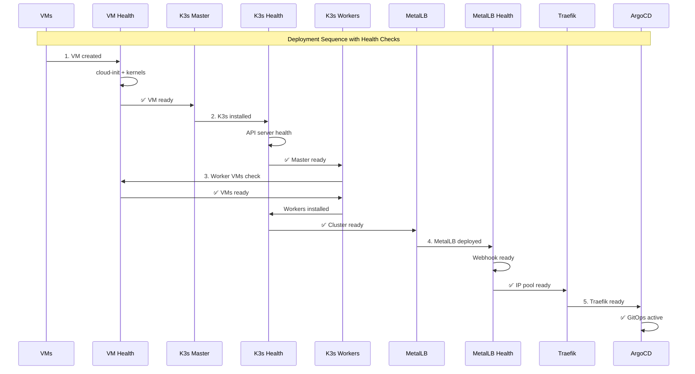

# Deployment Sequence Diagram

## Quick Reference: Component Dependencies



## Health Check Retry Logic

```
┌─────────────────┐    ┌──────────────────┐    ┌─────────────────┐
│   VM Health     │    │   K3s Health     │    │ MetalLB Health  │
│                 │    │                  │    │                 │
│ Max: 30 retries │    │ Max: 30 retries  │    │ Max: Pulumi     │
│ Interval: 10s   │    │ Interval: 10s    │    │ Annotations     │
│ Timeout: 5min   │    │ Timeout: 10min   │    │ Timeout: 5min   │
└─────────────────┘    └──────────────────┘    └─────────────────┘
```

## Dependency Tree

```
rzp-infra-staging/
├── k3s-cluster/
│   ├── master-vms → vm-health → k3s-install → k3s-health
│   └── worker-vms → vm-health → k3s-install → k3s-health
├── metallb/
│   ├── depends: [worker-health]
│   └── outputs: ipAddressPool
├── traefik/
│   ├── depends: [metallb.ipAddressPool] ← Fixed dependency
│   └── outputs: loadBalancer
└── argocd/
    ├── depends: [traefik]
    └── outputs: gitops-ready
```
