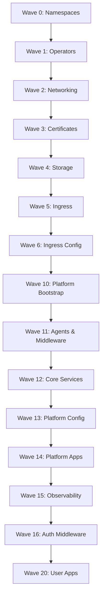

# ArgoCD Sync Wave Orchestration

This document provides a centralized view of all ArgoCD sync waves for deployment orchestration.

## 🎯 Sync Wave Strategy

```yaml
Wave 0: Namespaces & Prerequisites
Wave 1: Secrets & Operators
Wave 2: Load Balancing & Networking
Wave 3: Certificate Management
Wave 4: Storage Systems
Wave 5: Ingress Controllers
Wave 6: Ingress Configuration
Wave 10: Platform Services Bootstrap
Wave 11: Agent Services & Middleware
Wave 12: Core Platform Services
Wave 13: Platform Configuration
Wave 14: Platform Applications
Wave 15: Observability Services
Wave 16: Authentication Middleware
Wave 20: User Applications
```

## 📋 Complete Deployment Order

### **Wave 0: Foundation (Namespaces)**

```yaml
- cert-manager namespace
- traefik namespace
- metallb-system namespace
- infisical-secrets namespace
- longhorn-system namespace
- observability namespace
- vector-agent namespace
- netdata namespace
- zitadel namespace
- harness namespace
```

### **Wave 1: Secrets & Operators**

```yaml
- infisical-secrets-operator (Helm)
- metallb (Helm)
```

### **Wave 2: Networking & Load Balancing**

```yaml
- infisical-secrets-operator config
- metallb config (IPAddressPool, L2Advertisement)
```

### **Wave 3: Certificate Management**

```yaml
- cert-manager (Helm)
- cert-manager config
```

### **Wave 4: Storage Systems**

```yaml
- longhorn (Helm)
```

### **Wave 5: Ingress Controllers**

```yaml
- traefik (Helm)
```

### **Wave 6: Ingress Configuration**

```yaml
- traefik config
```

### **Wave 10: Platform Services Bootstrap**

```yaml
- platform-services (App of Apps)
```

### **Wave 11: Agent Services & Middleware**

```yaml
- vector-agent (DaemonSet)
- shared-config (Traefik middleware)
- traefik-common-middleware
```

### **Wave 12: Core Platform Services**

```yaml
- openobserve-postgres (Database)
- vector (Aggregator)
- zitadel-postgres (Database)
```

### **Wave 13: Platform Configuration**

```yaml
- vector config (RBAC, monitoring, networking)
- zitadel (Application)
```

### **Wave 14: Platform Applications**

```yaml
- zitadel config
```

### **Wave 15: Observability Services**

```yaml
- openobserve-app
- netdata (Helm)
- netdata config
```

### **Wave 16: Authentication Middleware**

```yaml
- zitadel-auth-middleware (Post-deployment)
```

### **Wave 20: User Applications**

```yaml
- harness (GitOps platform)
```

## 🔄 Dependencies Visualization



## 📊 Service Dependencies

### **Critical Path:**

1. **Namespaces** → **Operators** → **Networking** → **Storage**
2. **Storage** → **Databases** → **Applications** → **Configuration**
3. **Ingress** → **Middleware** → **Authentication** → **User Apps**

### **Parallel Deployments:**

- Vector Agent + Vector Aggregator (11 → 12)
- OpenObserve Postgres + Zitadel Postgres (both wave 12)
- Netdata + OpenObserve App (both wave 15)

## ⚠️ Important Notes

- **Wave gaps** allow for manual intervention if needed
- **Database services** deploy before applications that depend on them
- **Agent services** deploy before aggregation services
- **Authentication** middleware deploys after auth services are ready
- **User applications** deploy last to ensure all platform services are available

## 🔧 Troubleshooting

If deployment fails:

1. Check the failed wave in ArgoCD UI
2. Verify dependencies from previous waves are healthy
3. Check resource availability (CPU, memory, storage)
4. Validate network policies and ingress rules
5. Ensure secrets and certificates are properly created
